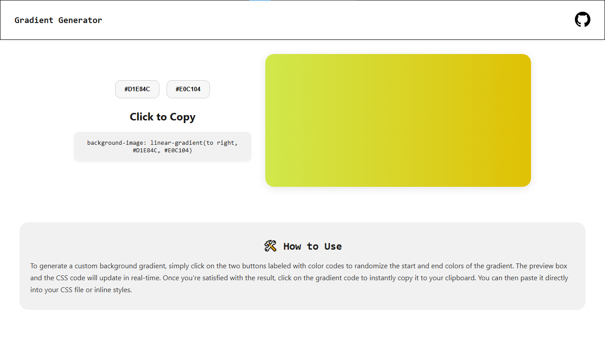

# 🎨 Background Gradient Generator

A simple and interactive tool to generate beautiful CSS background gradients with random colors.

---

## 🚀 Features

- Click on color buttons to generate random HEX colors
- Live background preview using linear-gradient
- Click to copy the final CSS code to clipboard
- Clean, responsive UI with a minimal design

---

## 🖥️ Tech Stack

- HTML
- CSS
- JavaScript

---

## Home page


## ✍️ Author
- Arvind Singh Panwar
---
## 📂 How to Use

1. Clone the repository:

```bash
git clone https://github.com/newdevatgit/Gradient-generator-tool

Open index.html in your browser.

No build steps or installation required.

```

🌟 Show Your Support
If you find this project helpful, feel free to give it a ⭐ on GitHub!

---
